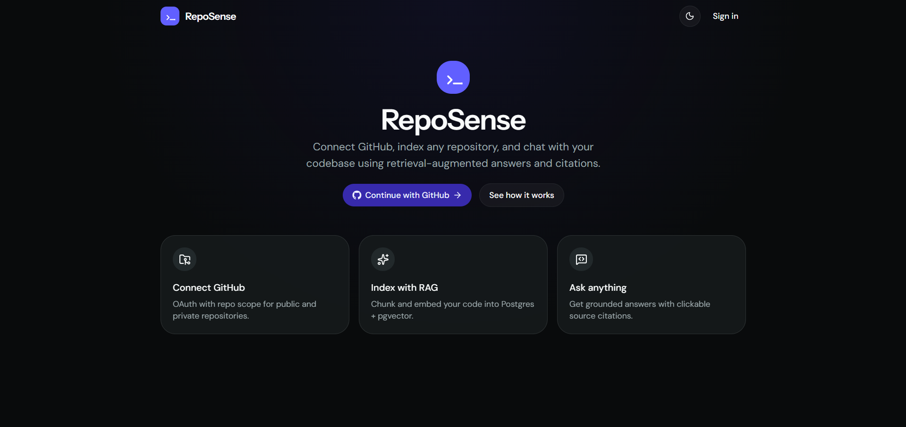
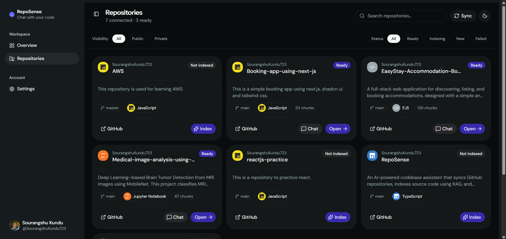
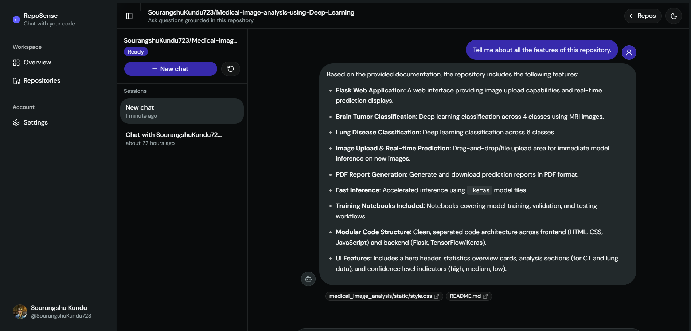

# RepoSense

RepoSense is an AI-powered codebase assistant that connects to GitHub, syncs all GitHub repositories, indexes repository source code, and lets you explore a codebase through grounded, citation-backed chat.

<div align="center">
    
</div>

## ✨ Features

- Sign in with GitHub OAuth.
- Browse public and private repositories available to the authenticated GitHub user.
- Index repository source code with chunking and embeddings.
- Store vectors in PostgreSQL with `pgvector`.
- Ask questions about an indexed repository through a streaming chat interface.
- View source citations with file paths and line ranges.
- Track repository indexing progress and failures from the dashboard.
- Manage repository chat sessions.

<div align="center">
    
    
</div>

## ⚙️ How It Works

1. The frontend starts a GitHub OAuth sign-in flow.
2. The Spring Boot backend stores the authenticated user and GitHub access token in the session-backed application flow.
3. A user selects a repository and starts indexing.
4. The backend fetches repository contents from GitHub, chunks source files, generates Gemini embeddings, and stores the chunks in PostgreSQL with `pgvector`.
5. Chat questions retrieve relevant chunks and stream a grounded answer with citations back to the Next.js client.

## 🤖 RAG Pipeline

RepoSense uses a retrieval-augmented generation (RAG) pipeline:

1. Repository source files are fetched from GitHub.
2. Supported files are split into smaller code chunks.
3. Each chunk is converted into a vector embedding.
4. Embeddings and metadata are stored in PostgreSQL with `pgvector`.
5. When a user asks a question, the question is embedded and used to retrieve relevant code chunks.
6. The retrieved context is passed to Gemini.
7. Gemini generates a grounded response with source-file and line-range citations.
8. The response is streamed to the frontend.

## 🧑‍💻 Technology Stack

- **Frontend:** Next.js, React, TypeScript, Tailwind CSS, TanStack Query
- **Backend:** Spring Boot, Spring Security OAuth2, Spring Data JPA, Spring AI
- **AI:** Google Gemini for chat and embeddings
- **Data:** PostgreSQL 16 with the `pgvector` extension
- **Authentication:** GitHub OAuth2
- **Local infrastructure:** Docker Compose

## 📋 Prerequisites

- Java 17 or later
- Node.js and npm
- Docker Desktop
- A Google Gemini API key
- A GitHub OAuth App

Maven is not required globally when using the Maven Wrapper included in `backend/`.

## 🚀 Local Development

### 1. Start PostgreSQL

From the repository root:

```bash
docker compose up -d postgres
```

This starts a `pgvector/pgvector:pg16` container on `localhost:5433` and creates the `reposense` database.

### 2. Configure the backend

Create a local environment file from the committed template:

```bash
cd backend
cp .env.example .env
```

On Windows PowerShell:

```powershell
Copy-Item .env.example .env
```

Edit `backend/.env` and provide your own values. Never commit this file.

For GitHub OAuth, configure the callback URL below in your GitHub OAuth App:

```text
http://localhost:8080/login/oauth2/code/github
```

The `TOKEN_ENCRYPTOR_SALT` value must be exactly 16 hexadecimal characters, for example `0123456789abcdef`. Use a strong, private password for `TOKEN_ENCRYPTOR_PASSWORD`.

### 3. Start the backend

From `backend/`:

```bash
./mvnw spring-boot:run
```

On Windows PowerShell:

```powershell
.\mvnw.cmd spring-boot:run
```

The backend runs at `http://localhost:8080`.

### 4. Start the frontend

In a second terminal:

```bash
cd client
npm install
npm run dev
```

The frontend runs at `http://localhost:3000`. It uses `http://localhost:8080` as the default backend URL.

To use a different backend URL, create `client/.env.local`:

```env
NEXT_PUBLIC_API_BASE_URL=http://localhost:8080
```

Open [http://localhost:3000](http://localhost:3000) and choose **Continue with GitHub**.

## 🔐 Environment Variables

The full backend template is available at [`backend/.env.example`](backend/.env.example).

| Variable | Purpose |
| --- | --- |
| `GEMINI_API_KEY` | Google Gemini API key for chat and embeddings |
| `GOOGLE_CLOUD_PROJECT` | Google Cloud project Id associated with Gemini |
| `DB_URL` | JDBC URL for PostgreSQL |
| `DB_USERNAME` | PostgreSQL username |
| `DB_PASSWORD` | PostgreSQL password |
| `TOKEN_ENCRYPTOR_PASSWORD` | Password used to encrypt stored GitHub tokens |
| `TOKEN_ENCRYPTOR_SALT` | 16-character hexadecimal encryption salt |
| `GITHUB_CLIENT_ID` | GitHub OAuth App client ID |
| `GITHUB_CLIENT_SECRET` | GitHub OAuth App client secret |
| `FRONTEND_URL` | Frontend URL used after OAuth login |
| `CORS_ALLOWED_ORIGINS` | Allowed browser origin for backend requests |

The frontend has one optional variable:

| Variable | Purpose |
| --- | --- |
| `NEXT_PUBLIC_API_BASE_URL` | Backend base URL; defaults to `http://localhost:8080` |

## 💻 Useful Commands

### Backend

```bash
cd backend
./mvnw test
./mvnw spring-boot:run
```

### Frontend

```bash
cd client
npm run lint
npm run build
npm run start
```

### Database

```bash
docker compose ps
docker compose logs -f postgres
docker compose down
```

Add `-v` to `docker compose down` only when you intentionally want to delete the local PostgreSQL volume and all stored data.

## 🔌 API Overview

The backend exposes authenticated API routes for:

- `/api/auth` - current user and logout operations
- `/api/repos` - list repositories, inspect a repository, start indexing, and read index status
- `/api/chat/sessions` - create, list, read, and delete chat sessions
- `/api/chat/sessions/{id}/messages` - stream chat responses for a session

The GitHub OAuth entry point is `/oauth2/authorization/github`.

## 📁 Project Structure

```text
.
├── backend/       Spring Boot API, OAuth, indexing, retrieval, and persistence
├── client/        Next.js frontend and dashboard
├── docker/        PostgreSQL initialization scripts
├── docker-compose.yml
└── README.md
```

## 🔧 Troubleshooting

### Database connection fails

Make sure Docker is running and PostgreSQL is healthy:

```bash
docker compose ps
docker compose logs postgres
```

Confirm that `DB_URL` uses port `5433`, matching the Docker Compose port mapping.

### GitHub login redirects or fails

Check that the OAuth callback URL exactly matches:

```text
http://localhost:8080/login/oauth2/code/github
```

Also verify `GITHUB_CLIENT_ID`, `GITHUB_CLIENT_SECRET`, `FRONTEND_URL`, and `CORS_ALLOWED_ORIGINS` in `backend/.env`.

### Indexing or chat fails

Check that `GEMINI_API_KEY` is valid, the repository has been indexed successfully, and the backend logs do not show API quota or database errors.

## 🔒 Security

- Do not commit `.env`, `.env.local`, API keys, OAuth secrets, database passwords, or token encryption values.
- Use [`backend/.env.example`](backend/.env.example) as the safe configuration template.
- Rotate any credential that has been exposed publicly.
- Use separate credentials and encryption values for development and production.

## 📄 License

See [`LICENSE`](LICENSE) for the project license.
